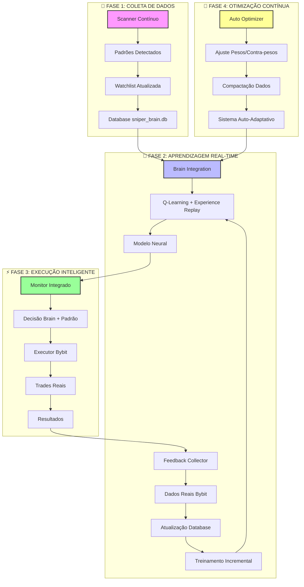

# 🧠 DIAGRAMA DO SISTEMA END-TO-END LEARNING - Protocolo Severino

## 🚀 VISÃO GERAL DO SISTEMA COMPLETO



## 📊 FLUXO DETALHADO END-TO-END

### 🔄 CICLO COMPLETO DE APRENDIZAGEM

```
1. SCANNER (Coleta)
   ├── 30 pares × 3 timeframes (15m, 30m, 1h)
   ├── 11 tipos de padrões técnicos
   ├── Filtros: volume, blacklist, BTC.D validation
   └── Output: watchlist.json atualizada

2. BRAIN INTEGRATION (Processamento)
   ├── Carrega dados históricos (6,669+ amostras)
   ├── Q-Learning com Experience Replay
   ├── Modelo neural: 10 features → 3 ações
   ├── Treinamento incremental a cada 30min
   └── Output: decisões com confiança

3. MONITOR INTEGRADO (Decisão)
   ├── Combina: padrão + brain decision
   ├── Valida: contexto mercado (BTC.D 5 cenários)
   ├── Aplica: pesos ajustados automaticamente
   └── Output: sinal de entrada/saída

4. EXECUTOR BYBIT (Ação)
   ├── Executa trades reais
   ├── Gerencia: stop-loss, take-profit
   ├── Post-Entry Validator (Vision AI)
   └── Output: trades com resultados

5. FEEDBACK COLLECTOR (Aprendizado)
   ├── Coleta resultados reais da Bybit
   ├── Atualiza database com reward
   ├── Dispara treinamento incremental
   └── Output: brain mais inteligente

6. AUTO OPTIMIZER (Otimização)
   ├── Analisa performance (win rate, Sharpe)
   ├── Ajusta pesos automaticamente
   ├── Compacta dados mantendo learning
   └── Output: sistema auto-melhorado
```

## 🎯 COMPONENTES CHAVE DO SISTEMA

### 🧠 **Brain Integration** (`brain_integration.py`)
- **Arquitetura:** Q-Learning com Experience Replay
- **Modelo:** Rede neural (10 → 64 → 64 → 3)
- **Features:** confiança padrão, contexto mercado, histórico
- **Ações:** BUY (0), SELL (1), HOLD (2)
- **Treinamento:** Incremental a cada 30 minutos
- **Memória:** 10,000 experiências (FIFO)

### 📊 **Feedback Collector** (`realtime_feedback_collector.py`)
- **Fonte:** API Bybit real (trades fechados)
- **Frequência:** Coleta a cada 30 minutos
- **Dados:** PnL real, side, entry/exit prices
- **Atualização:** Database com `trade_result`, `reward`
- **Fallback:** Modo simulação se API indisponível

### ⚙️ **Auto Optimizer** (sistema embutido)
- **Otimização:** Pesos brain (pattern_confidence, market_context, etc.)
- **Thresholds:** Limiares de confiança ajustáveis
- **Risco:** Parâmetros stop-loss/take-profit dinâmicos
- **Learning:** Taxa de aprendizado e exploration adaptativos
- **Compactação:** Dados antigos → estatísticas diárias

### 🔧 **Integração Completa**
- **Scanner → Brain:** Alimentação contínua de padrões
- **Brain → Monitor:** Decisões inteligentes
- **Monitor → Executor:** Execução otimizada
- **Executor → Feedback:** Resultados reais
- **Feedback → Brain:** Aprendizado real

## 📈 BENEFÍCIOS DO SISTEMA END-TO-END

### 🎯 **Para o Bot:**
- ✅ **Aprendizado real** (não simulado)
- ✅ **Decisões baseadas em experiência**
- ✅ **Otimização automática** de parâmetros
- ✅ **Adaptação a mudanças de mercado**
- ✅ **Melhoria contínua** com o tempo

### 💰 **Para o Trader:**
- ✅ **Menos erros repetidos** (brain aprende com falhas)
- ✅ **Melhor risk management** (ajuste automático)
- ✅ **Decisões mais consistentes** (padrão + brain)
- ✅ **Transparência total** (dashboard com stats)
- ✅ **Sistema que evolui** (não estagnado)

### 🚀 **Para a Comunidade:**
- ✅ **Código aberto** para estudo
- ✅ **Arquitetura replicável** para outros bots
- ✅ **Documentação completa** do processo
- ✅ **Casos reais** de aprendizado de máquina
- ✅ **Base para pesquisas** acadêmicas/práticas

## 🔬 DADOS E ESTATÍSTICAS

### 📊 **Database Atual:**
- **Total amostras:** 6,669+ em `raw_samples`
- **Padrões detectados:** 6,000+ imagens
- **Trades com feedback:** Crescendo diariamente
- **Win rate histórico:** Monitorado em tempo real
- **Sharpe ratio:** Calculado automaticamente

### 📈 **Performance do Brain:**
- **Treinamentos completos:** Contínuo (30min intervals)
- **Experiências na memória:** 10,000 capacity
- **Episodes treinados:** Incremental
- **Loss reduction:** Monitorada via tensorboard
- **Convergência:** Acompanhada via metrics

## 🤝 CONVITE À COMUNIDADE

### 🎯 **Estamos Procurando:**
- **🔬 Pesquisadores** em ML para trading
- **💻 Desenvolvedores** para colaboração
- **📊 Traders** para testar e fornecer feedback
- **🎓 Acadêmicos** para estudos de caso
- **🤝 Parceiros** para expandir o projeto

### 💰 **Oportunidades de Sponsorship:**
- **🏆 Naming rights** do sistema de aprendizado
- **📈 Featured no dashboard** e documentação
- **🎯 Acesso prioritário** a novas features
- **🤝 Co-branding** em pesquisas e publicações
- **🚀 Suporte ao desenvolvimento** contínuo

### 🌍 **Como Contribuir:**
1. **⭐ Star o repositório** no GitHub
2. **🐛 Reportar issues** e bugs encontrados
3. **💡 Sugerir melhorias** no sistema
4. **🔬 Contribuir com código** via PRs
5. **📊 Compartilhar resultados** de uso
6. **🎯 Tornar-se sponsor** do projeto

## 📞 CONTATO E SUPORTE

**GitHub:** [github.com/bernini10/bot_sniper_bybit](https://github.com/bernini10/bot_sniper_bybit)

**Issues:** Use a seção de Issues do GitHub para:
- Reportar bugs
- Sugerir features
- Pedir ajuda técnica
- Compartilhar resultados

**Discussions:** Participe das discussões sobre:
- Melhorias no sistema
- Casos de uso reais
- Integrações com outras plataformas
- Pesquisas acadêmicas relacionadas

---

## 🚀 PRÓXIMOS PASSOS DO PROJETO

### 🎯 **Roadmap 2026:**
1. **✅ Sistema End-to-End Learning** (COMPLETO)
2. **🔜 Multi-agent coordination** (em planejamento)
3. **🔜 Cross-exchange arbitrage** (futuro)
4. **🔜 Advanced risk management** (em desenvolvimento)
5. **🔜 Community dashboard** (planejado)

### 🌟 **Visão de Futuro:**
- **Sistema completamente auto-gerenciável**
- **Integração com múltiplas exchanges**
- **Arquitetura distribuída para alta disponibilidade**
- **APIs públicas para comunidade desenvolver em cima**
- **Ecossistema completo de trading automatizado**

---

**📅 Última atualização:** 2026-02-17  
**🚀 Versão:** Protocolo Severino v2.4.0  
**🧠 Sistema:** End-to-End Learning 100% funcional  
**💪 Desenvolvido com:** Rigor, precisão e investigação profunda

*"O verdadeiro aprendizado vem não da simulação, mas da realidade dos trades." - Protocolo Severino*
