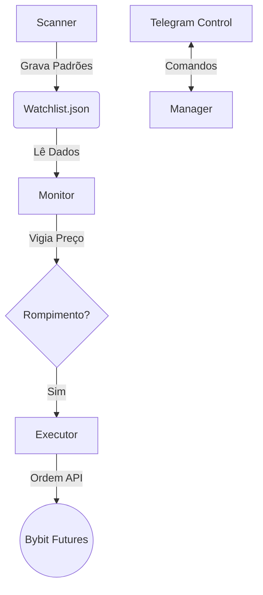

# 🦅 Bot Sniper Bybit v2.1 (Institutional Edition)

Um sistema de trading algorítmico de alta performance para o mercado de futuros de criptomoedas, desenhado com arquitetura modular, gestão de risco profissional e controle remoto via Telegram.

## 🚀 Funcionalidades Principais

*   **Arquitetura "Hunter-Killer":**
    *   `Scanner`: Varrredura contínua de 30+ pares em múltiplos timeframes (15m, 1h, 4h).
    *   `Monitor`: Vigia de preço "Just-in-Time". Dispara o trade apenas no rompimento exato (Tick-by-Tick).
    *   `Executor`: Módulo "Fire-and-Forget". Entra a mercado, define Stop/Target na exchange e ativa proteção de lucro.
*   **Gestão de Risco Profissional:**
    *   Cálculo de lote baseado em risco fixo (ex: 1.5% da banca por trade).
    *   Proteção contra alavancagem excessiva.
*   **Defesa de Capital:**
    *   **Break-Even Automático:** Move o Stop para a entrada ao atingir 50% do alvo.
    *   **Filtro de Tendência:** Só opera a favor da tendência macro do Bitcoin (SMA 200).
    *   **Filtro de Volume:** Ignora rompimentos sem volume relevante.
*   **Centro de Comando Telegram:**
    *   Monitore saldo, watchlist e status do servidor.
    *   Receba alertas em tempo real de padrões encontrados e ordens executadas.

## 🛠️ Arquitetura do Sistema

O sistema roda 3 processos concorrentes orquestrados pelo `bot_manager.py`:



## 📋 Pré-requisitos

*   Python 3.10+
*   Conta na Bybit (Futuros) com API Key (Permissões: Orders, Positions).
*   Bot no Telegram (via BotFather).

## ⚙️ Instalação

1.  **Clone o repositório:**
    ```bash
    git clone https://github.com/bernini10/bot_sniper_bybit.git
    cd bot_sniper_bybit
    ```

2.  **Instale as dependências:**
    ```bash
    pip install ccxt pandas numpy scipy requests
    ```

3.  **Configure os Segredos:**
    Crie um arquivo `.env` na raiz:
    ```env
    BYBIT_API_KEY=sua_key_aqui
    BYBIT_SECRET=seu_secret_aqui
    TELEGRAM_TOKEN=seu_token_telegram
    TELEGRAM_CHAT_ID=seu_id_telegram
    ```

## 🎮 Como Usar

### Iniciar o Sistema
O `bot_manager.py` cuida de tudo (logs, restarts, processos):

```bash
# Iniciar (Background)
python3 bot_manager.py start

# Ver Status
python3 bot_manager.py status

# Parar
python3 bot_manager.py stop
```

### Comandos Telegram
No seu chat com o bot:
*   `/status` - Saúde do sistema e PIDs ativos.
*   `/wl` - Ver a Watchlist atual (oportunidades em formação).
*   `/saldo` - Saldo atualizado da carteira de Futuros.
*   `/restart` - Reinicia o sistema remotamente.

## 🛡️ Segurança e Robustez
*   **File Locking:** Sistema imune a "Race Conditions" (uso de `fcntl` para travar arquivos JSON).
*   **Self-Healing:** O Manager reinicia processos que falham silenciosamente.
*   **Estado Persistente:** Se o servidor reiniciar, o bot retoma a watchlist do disco.

---
*Desenvolvido por Severino AI - v2.1*
