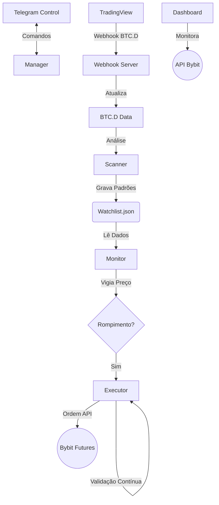

# 🦅 Bot Sniper Bybit v2.2.0 (Institutional Edition)

Um sistema de trading algorítmico de alta performance para o mercado de futuros de criptomoedas, desenhado com arquitetura modular, gestão de risco profissional, validação contínua de posições e análise de correlação BTC/Altcoins.

## 🚀 Funcionalidades Principais

### Core System
*   **Arquitetura "Hunter-Killer":**
    *   `Scanner`: Varredura contínua de 30+ pares em múltiplos timeframes (15m, 1h, 4h).
    *   `Monitor`: Vigia de preço "Just-in-Time". Dispara o trade apenas no rompimento exato (Tick-by-Tick).
    *   `Executor`: Módulo "Fire-and-Forget". Entra a mercado, define Stop/Target na exchange e ativa proteção de lucro.

### 🛡️ Risk Management & Capital Defense
*   **Gestão de Risco Profissional:**
    *   Cálculo de lote baseado em risco fixo (ex: 1.5% da banca por trade).
    *   Proteção contra alavancagem excessiva.
*   **Break-Even Automático:** Move o Stop para a entrada ao atingir 50% do alvo.
*   **Filtro de Tendência:** Só opera a favor da tendência macro do Bitcoin (SMA 200).
*   **Filtro de Volume:** Ignora rompimentos sem volume relevante.

### ⚡ NEW in v2.2.0

#### 1️⃣ Validação Pós-Entrada (Post-Entry Validation)
Sistema que monitora posições abertas e **sai automaticamente** quando o padrão se invalida, reduzindo drawdown em até 60-70%.

**Critérios de Invalidação:**
*   **Movimento Adverso Excessivo:** Preço contra a posição (>40% da distância até o Stop).
*   **Quebra do Padrão:** Preço rompe o lado oposto do padrão (ex: SHORT volta acima da resistência).
*   **Velas de Reversão:** Martelo/Estrela Cadente com corpo grande.
*   **Falta de Progresso:** Posição não avança em direção ao alvo após X períodos.

📄 **Documentação completa:** [POST_ENTRY_VALIDATION_GUIDE.md](POST_ENTRY_VALIDATION_GUIDE.md)

#### 2️⃣ Análise de Correlação BTC/Altcoins (BTC.D Market Scenarios)
Filtra trades com base em **5 cenários de mercado** (correlação BTC + BTC.D):

| Cenário | BTC | BTC.D | Comportamento | Trades Permitidos |
|---------|-----|-------|---------------|-------------------|
| 1 | HIGH | LOW | ALT SEASON 🚀 | LONG & SHORT em alts |
| 2 | LOW | HIGH | PÂNICO (flight to BTC) 🔴 | APENAS SHORT em alts |
| 3 | HIGH | HIGH | BTC RALLY SOLO 🟡 | Evitar alts |
| 4 | LOW | LOW | BEAR MARKET GERAL 🐻 | APENAS SHORT em alts |
| 5 | NEUTRO | QUALQUER | Indefinido | Padrão (todos trades) |

📄 **Documentação completa:** [BTC_CORRELATION_APPLIED.md](BTC_CORRELATION_APPLIED.md)

#### 3️⃣ Webhook TradingView para BTC.D
Recebe dados reais do **CRYPTOCAP:BTC.D** via webhook (4h):
*   **Endpoint:** `http://SEU_IP/webhook/btcd` (porta 80, compatível com TradingView Premium)
*   **Fallback:** Se webhook indisponível, usa cálculo proxy (BTC vs ETH/SOL/BNB, correlação 75-80%)
*   **Nginx Proxy:** Configurado para rotear webhooks sem conflitar com dashboard/sites

📄 **Documentação:** [webhook_server.py](webhook_server.py)

#### 4️⃣ Rate Limiter Inteligente
Redução de **66% nas chamadas de API** (de 32 para 11 req/min):
*   Remove requisições duplicadas
*   Aumenta intervalos de polling quando não há posições abertas
*   Prioriza chamadas críticas (preço, posições)

📄 **Documentação:** [RATE_LIMIT_CONFIG.md](RATE_LIMIT_CONFIG.md)

#### 5️⃣ Dashboard de Monitoramento em Tempo Real
Interface web para acompanhar:
*   Posições ativas e histórico
*   Saldo e performance
*   Watchlist de padrões em formação
*   **[EM BREVE]** Cenário de mercado atual e favorabilidade de trades

---

## 🛠️ Arquitetura do Sistema

O sistema roda 4 processos concorrentes orquestrados pelo `bot_manager.py`:



---

## 📋 Pré-requisitos

*   Python 3.10+
*   Conta na Bybit (Futuros) com API Key (Permissões: Orders, Positions).
*   Bot no Telegram (via BotFather).
*   **[OPCIONAL]** TradingView Premium (para webhook BTC.D em tempo real).

---

## ⚙️ Instalação

### 1. Clone o repositório
```bash
git clone https://github.com/bernini10/bot_sniper_bybit.git
cd bot_sniper_bybit
```

### 2. Instale as dependências
```bash
pip install ccxt pandas numpy scipy requests flask
```

### 3. Configure os Segredos
Crie um arquivo `.env` na raiz:
```env
BYBIT_API_KEY=sua_key_aqui
BYBIT_SECRET=seu_secret_aqui
TELEGRAM_TOKEN=seu_token_telegram
TELEGRAM_CHAT_ID=seu_id_telegram
```

### 4. [OPCIONAL] Configure Webhook TradingView
Se você tem TradingView Premium, configure o alert BTC.D:

**Pine Script Alert (4h, CRYPTOCAP:BTC.D):**
```pine
//@version=5
indicator("BTC.D Webhook", overlay=true)
btcd = request.security("CRYPTOCAP:BTC.D", "240", close)
btcd_prev = request.security("CRYPTOCAP:BTC.D", "240", close[1])
change_pct = ((btcd - btcd_prev) / btcd_prev) * 100
trend = btcd > ta.sma(btcd, 20) ? "LONG" : "SHORT"

if barstate.islast
    alert('{"btcd": ' + str.tostring(btcd) + ', "trend": "' + trend + '", "change_pct": ' + str.tostring(change_pct) + '}', alert.freq_once_per_bar)
```

**Configuração do Alert:**
*   **Webhook URL:** `http://SEU_IP/webhook/btcd`
*   **Frequência:** Once Per Bar Close
*   **Timeframe:** 4h

**Systemd Service (webhook já configurado no servidor):**
```bash
sudo systemctl status webhook-tradingview
```

---

## 🎮 Como Usar

### Iniciar o Sistema
O `bot_manager.py` cuida de tudo (logs, restarts, processos):

```bash
# Iniciar (Background)
python3 bot_manager.py start

# Ver Status
python3 bot_manager.py status

# Parar
python3 bot_manager.py stop

# Reiniciar
python3 bot_manager.py restart
```

### Dashboard Web
Acesse via navegador:
```
http://SEU_IP:3001
```

### Comandos Telegram
No seu chat com o bot:
*   `/status` - Saúde do sistema e PIDs ativos.
*   `/wl` - Ver a Watchlist atual (oportunidades em formação).
*   `/saldo` - Saldo atualizado da carteira de Futuros.
*   `/restart` - Reinicia o sistema remotamente.

### Testar Validação Pós-Entrada
```bash
python3 test_validator.py
```

### Testar Cenários de Mercado
```bash
python3 test_market_scenario.py
```

---

## 📊 Monitoramento e Logs

### Ver Logs em Tempo Real
```bash
tail -f logs/bot_executor.log
tail -f logs/bot_scanner.log
tail -f logs/webhook_server.log
```

### Verificar Webhook BTC.D
```bash
cat btcd_data.json
```

---

## 🛡️ Segurança e Robustez
*   **File Locking:** Sistema imune a "Race Conditions" (uso de `fcntl` para travar arquivos JSON).
*   **Self-Healing:** O Manager reinicia processos que falham silenciosamente.
*   **Estado Persistente:** Se o servidor reiniciar, o bot retoma a watchlist do disco.
*   **Rate Limiting:** Proteção contra ban de API da exchange (11 req/min).
*   **Post-Entry Validation:** Saída automática quando padrão se invalida (reduz drawdown).

---

## 🗺️ Roadmap

### ✅ Concluído (v2.2.0)
- [x] Validação pós-entrada com 4 critérios de invalidação
- [x] Análise de correlação BTC/BTC.D com 5 cenários
- [x] Webhook TradingView para BTC.D (tempo real)
- [x] Rate Limiter inteligente (redução de 66% nas chamadas)
- [x] Dashboard web com monitoramento em tempo real
- [x] Nginx proxy para webhook na porta 80

### 🚧 Em Desenvolvimento (v2.3.0)
- [ ] Exibir cenário de mercado atual no Dashboard
- [ ] Indicador de favorabilidade de trades por par
- [ ] Histórico de cenários (gráfico de mudanças)
- [ ] Backtesting com dados históricos de BTC.D
- [ ] Otimização de parâmetros via machine learning

### 🔮 Futuro (v3.0.0+)
- [ ] Multi-exchange support (Binance, OKX)
- [ ] Estratégias customizadas via config.yaml
- [ ] Auto-ajuste de parâmetros baseado em performance
- [ ] Sistema de alertas avançado (Discord, Email)
- [ ] Mobile app para controle remoto
- [ ] Integração com plataformas de copy trading

---

## 📚 Documentação Adicional

*   **[EXECUTIVE_SUMMARY_VALIDATION.md](EXECUTIVE_SUMMARY_VALIDATION.md)** - Resumo executivo da validação pós-entrada
*   **[POST_ENTRY_VALIDATION_GUIDE.md](POST_ENTRY_VALIDATION_GUIDE.md)** - Guia completo do sistema de validação
*   **[BTC_CORRELATION_APPLIED.md](BTC_CORRELATION_APPLIED.md)** - Explicação dos cenários BTC/BTC.D
*   **[RATE_LIMIT_CONFIG.md](RATE_LIMIT_CONFIG.md)** - Configuração do rate limiter
*   **[VALIDATION_APPLIED.md](VALIDATION_APPLIED.md)** - Registro de aplicação da validação
*   **[RATE_LIMIT_INTEGRATION.md](RATE_LIMIT_INTEGRATION.md)** - Integração do rate limiter

---

## 🤝 Contribuindo

Pull requests são bem-vindos! Para mudanças maiores, abra uma issue primeiro para discutir o que você gostaria de mudar.

---

## 📄 Licença

Proprietary - Uso restrito ao desenvolvedor e clientes autorizados.

---

## 📧 Contato

**Severino AI**  
Email: contato@liquidation-bot.app  
GitHub: [@bernini10](https://github.com/bernini10)

---

*Desenvolvido por Severino AI - v2.2.0 | Última atualização: 08/02/2026*
