# 🦅 Bot Sniper Bybit v2.4.0 (PROTOCOLO SEVERINO)

Um sistema de trading algorítmico de alta performance para o mercado de futuros de criptomoedas, desenhado com arquitetura modular, gestão de risco profissional, validação contínua de posições, análise de correlação BTC/Altcoins e **PROTOCOLO SEVERINO** completo para segurança máxima.

## 🚀 Funcionalidades Principais

### Core System
*   **Arquitetura "Hunter-Killer":**
    *   `Scanner`: Varredura contínua de 30+ pares em múltiplos timeframes (15m, 1h, 4h).
    *   `Monitor`: Vigia de preço "Just-in-Time". Dispara o trade apenas no rompimento exato (Tick-by-Tick).
    *   `Executor`: Módulo "Fire-and-Forget". Entra a mercado, define Stop/Target na exchange e ativa proteção de lucro.
*   **PROTOCOLO SEVERINO:** Validação BTC.D em tempo real + 5 cenários de mercado + monitoramento de mudança de cenário.

### 🛡️ Risk Management & Capital Defense
*   **Gestão de Risco Profissional:**
    *   Cálculo de lote baseado em risco fixo (ex: 1.5% da banca por trade).
    *   Proteção contra alavancagem excessiva.
*   **Break-Even Automático:** Move o Stop para a entrada ao atingir 50% do alvo.
*   **Filtro de Tendência:** Só opera a favor da tendência macro do Bitcoin (SMA 200).
*   **Filtro de Volume:** Ignora rompimentos sem volume relevante.

### ⚡ NEW in v2.4.0 - PROTOCOLO SEVERINO

#### 🛡️ 1️⃣ PROTOCOLO SEVERINO - Validação BTC.D Avançada
Sistema completo de validação de mercado baseado em BTC.D em tempo real com **5 cenários precisos**:

| Cenário | BTC | BTC.D | Comportamento | Trades Permitidos | Regra Severino |
|---------|-----|-------|---------------|-------------------|----------------|
| 1 | ↗ | ↗ | Dinheiro indo pro BTC | ❌ LONGs, ✅ SHORTs | EVITAR LONGs em alts |
| 2 | ↘ | ↗ | PÂNICO nas alts | ❌ LONGs, ✅ SHORTs | SHORTs favorecidos |
| 3 | ↗ | ↘ | ALT SEASON 🚀 | ✅ LONGs, ❌ SHORTs | MELHOR para LONGs |
| 4 | ↘ | ↘ | Alts segurando | ✅ LONGs, ✅ SHORTs | Permite ambos com cautela |
| 5 | NEUTRO | NEUTRO | Mercado lateral | ✅ LONGs, ✅ SHORTs | Permite ambos |

**Funcionalidades:**
*   **Validação pré-trade:** Bloqueia trades em cenário desfavorável
*   **Monitoramento contínuo:** Fecha trades se cenário mudar
*   **Webhook TradingView:** Dados em tempo real (15min + se mudar >0.3%)
*   **Fallback proxy:** Funciona mesmo se webhook falhar

📄 **Documentação:** [market_context_validator.py](market_context_validator.py)

#### 🧠 2️⃣ Sistema de Aprendizado End-to-End (Brain)
Machine Learning com Q-Learning + Experience Replay:
*   **48 estados** aprendidos automaticamente
*   **Treinamento contínuo** a cada 60 minutos
*   **Dashboard de monitoramento:** `brain_dashboard.py`
*   **Integração completa:** Analisa padrões antes da execução

📄 **Documentação:** [brain_architecture.md](brain_architecture.md), [INTEGRATION_GUIDE.md](INTEGRATION_GUIDE.md)

#### 🐛 3️⃣ Correção Crítica - Bug de Direção
**Problema resolvido:** Executor entrava LONG quando padrão era SHORT (DOT/USDT, SOL/USDT)
**Solução:** Validação de consistência direção no executor V2
**Impacto:** Elimina trades na direção errada

📄 **Código corrigido:** [bot_executor.py](bot_executor.py)

#### 🔄 4️⃣ Validação Pós-Entrada V2.3.1
Aprimoramento do sistema com **monitoramento de cenário**:
*   **Threshold aumentado:** 0.70 → 0.85
*   **Confirmação dupla:** Exige 2 candles consecutivos INVALID para fechar
*   **Tolerância a pullbacks:** Prompt ajustado para evitar saídas prematuras
*   **+ Monitoramento BTC.D:** Fecha trade se cenário mudar contra posição

📄 **Documentação:** [post_entry_validator.py](post_entry_validator.py)

#### 📊 5️⃣ Dashboard Completo
Interface web com todas métricas:
*   ✅ Posições ativas e histórico
*   ✅ **Cenário de mercado atual** (BTC.D + favorabilidade)
*   ✅ Watchlist de padrões em formação
*   ✅ **Status Brain Learning** (estados aprendidos, win rate)
*   ✅ Performance e estatísticas
*   ✅ **Verificação de saúde** do sistema

🔗 **Acesso:** `http://localhost:8080`

---

## 🛠️ Arquitetura do Sistema - PROTOCOLO SEVERINO

O sistema roda 5 processos concorrentes orquestrados pelo `bot_manager.py` com validações em cascata:

```mermaid
graph TD
    A[Scanner] -->|Detecta Padrões| B(Watchlist.json)
    B -->|Lê Dados| C[Monitor]
    C -->|Vigia Preço| D{Rompimento?}
    D -- Sim --> E[Validação BTC.D]
    E -->|Cenário Favorável?| F{Brain Analysis}
    F -->|Aprova| G[Executor]
    G -->|Valida Consistência| H{Direção Correta?}
    H -->|Sim| I[Executa Trade]
    I -->|Ordem API| J((Bybit Futures))
    K[TradingView] -->|Webhook BTC.D<br/>15min + >0.3%| L[Webhook Server]
    L -->|Atualiza| M[BTC.D Data]
    M -->|Análise Cenário| E
    N[Brain Trainer] -->|Aprende| O[Q-Learning Model]
    O -->|Decisões| F
    P[Post Entry Validator] -->|Monitora| I
    P -->|Cenário Mudou?| Q{Fecha Trade}
    R[Dashboard] -->|Monitora| S((Todos Processos))
    
    style E fill:#ff9999
    style F fill:#99ff99
    style H fill:#ffcc99
    style Q fill:#ff6666
```



---

## 📋 Pré-requisitos

*   Python 3.10+
*   Conta na Bybit (Futuros) com API Key (Permissões: Orders, Positions).
*   Bot no Telegram (via BotFather).
*   **[OPCIONAL]** TradingView Premium (para webhook BTC.D em tempo real).

---

## ⚙️ Instalação

### 1. Clone o repositório
```bash
git clone https://github.com/bernini10/bot_sniper_bybit.git
cd bot_sniper_bybit
```

### 2. Instale as dependências
```bash
pip install ccxt pandas numpy scipy requests flask
```

### 3. Configure os Segredos
Crie um arquivo `.env` na raiz:
```env
BYBIT_API_KEY=sua_key_aqui
BYBIT_SECRET=seu_secret_aqui
TELEGRAM_TOKEN=seu_token_telegram
TELEGRAM_CHAT_ID=seu_id_telegram
```

### 4. [RECOMENDADO] Configure Webhook TradingView PROTOCOLO SEVERINO
Para dados BTC.D em tempo real, configure o alerta no TradingView:

**Pine Script Alert (15min + detecção >0.3%, CRYPTOCAP:BTC.D):**
```pine
//@version=5
indicator("BTC.D Monitor - Severino", overlay=false)

SEND_ON_CHANGE = input.bool(true, "Só se mudar >0.3%")
btcDom = request.security("CRYPTOCAP:BTC.D", "15", close)
sma20 = ta.sma(btcDom, 20)
direction = btcDom > sma20 ? "LONG" : "SHORT"
change_pct = ((btcDom - btcDom[1]) / btcDom[1]) * 100

is_candle_close = barstate.isconfirmed
significant_change = math.abs(change_pct) >= 0.3
should_alert = is_candle_close and (not SEND_ON_CHANGE or significant_change)

btcDomStr = str.tostring(btcDom, "#.##")
changeStr = str.tostring(change_pct, "#.##")
jsonMessage = '{"btc_d_value": ' + btcDomStr + ', "direction": "' + direction + '", "change_pct": ' + changeStr + '}'

if should_alert
    alert(jsonMessage, alert.freq_once_per_bar_close)
```

**Configuração do Alert:**
*   **Webhook URL:** `http://SEU_IP/webhook/btcd`
*   **Mensagem:** `{{alert.message}}`
*   **Frequência:** "Qualquer chamada de função"
*   **Timeframe do gráfico:** 15 minutos (recomendado)

**Arquivo Pine completo:** [btcd_tradingview_frequent.pine](btcd_tradingview_frequent.pine)

### 5. Instale o Sistema Brain Learning
```bash
# Instalação completa do sistema de aprendizado
python3 setup_brain_system.py

# Iniciar treinamento contínuo (background)
./start_brain_learning.sh

# Verificar status do Brain
tail -f brain_logs/learning.log
```

---

## 🎮 Como Usar

### Iniciar o Sistema
O `bot_manager.py` cuida de tudo (logs, restarts, processos):

```bash
# Iniciar (Background)
python3 bot_manager.py start

# Ver Status
python3 bot_manager.py status

# Parar
python3 bot_manager.py stop

# Reiniciar
python3 bot_manager.py restart
```

### Dashboard Web
Acesse via navegador:
```
http://SEU_IP:3001
```

### Comandos Telegram
No seu chat com o bot:
*   `/status` - Saúde do sistema e PIDs ativos.
*   `/wl` - Ver a Watchlist atual (oportunidades em formação).
*   `/saldo` - Saldo atualizado da carteira de Futuros.
*   `/restart` - Reinicia o sistema remotamente.

### Testar PROTOCOLO SEVERINO
```bash
# Verificar cenário de mercado atual
python3 market_context_validator.py

# Testar validação de trade
python3 -c "from market_context_validator import validate_trade_entry; print(validate_trade_entry('LONG'))"

# Verificação completa do sistema
./verificacao_completa.sh

# Testar sistema Brain
python3 test_brain_system.py
```

---

## 📊 Monitoramento e Logs

### Ver Logs em Tempo Real
```bash
tail -f logs/bot_executor.log
tail -f logs/bot_scanner.log
tail -f logs/webhook_server.log
```

### Verificar Webhook BTC.D e Cenário
```bash
# Dados BTC.D recebidos
cat btcd_data.json

# Cenário atual e regras
python3 -c "from market_context_validator import get_current_market_summary; print(get_current_market_summary())"

# Health check do webhook
curl http://localhost:5555/health
```

---

## 🛡️ Segurança e Robustez
*   **File Locking:** Sistema imune a "Race Conditions" (uso de `fcntl` para travar arquivos JSON).
*   **Self-Healing:** O Manager reinicia processos que falham silenciosamente.
*   **Estado Persistente:** Se o servidor reiniciar, o bot retoma a watchlist do disco.
*   **Rate Limiting:** Proteção contra ban de API da exchange (11 req/min).
*   **Post-Entry Validation:** Saída automática quando padrão se invalida (reduz drawdown).

---

## 🗺️ Roadmap

### ✅ Concluído (v2.4.0 - PROTOCOLO SEVERINO)
- [x] **PROTOCOLO SEVERINO:** Validação BTC.D em tempo real com 5 cenários precisos
- [x] **Correção crítica:** Bug de direção invertida (DOT/USDT, SOL/USDT)
- [x] **Monitoramento contínuo:** Fecha trades se cenário mudar
- [x] **Sistema Brain Learning:** Q-Learning com Experience Replay (48 estados)
- [x] **Webhook TradingView:** Dados atualizados a cada 15min + se mudar >0.3%
- [x] **Dashboard completo:** Cenário atual + status Brain + todas métricas
- [x] **Validação pós-entrada V2.3.1:** Threshold 0.85 + confirmação dupla
- [x] **Verificação automática:** Script `verificacao_completa.sh`

### ✅ Concluído Anteriormente (v2.2.0 → v2.3.0)
- [x] Validação pós-entrada com 4 critérios de invalidação
- [x] Análise de correlação BTC/BTC.D com 5 cenários
- [x] Webhook TradingView para BTC.D (tempo real)
- [x] Rate Limiter inteligente (redução de 66% nas chamadas)
- [x] Dashboard web com monitoramento em tempo real
- [x] Nginx proxy para webhook na porta 80
- [x] Exibir cenário de mercado atual no Dashboard
- [x] Vision AI integration para validação de padrões

### 🚧 Em Desenvolvimento (v2.5.0)
- [ ] **Otimização Brain:** Hiperparâmetros automáticos baseados em performance
- [ ] **Multi-timeframe analysis:** Análise conjunta 15min + 1h + 4h
- [ ] **Alertas inteligentes:** Notificações quando cenário muda significativamente
- [ ] **Backtesting integrado:** Teste estratégias com dados históricos de BTC.D
- [ ] **Relatórios automáticos:** Performance weekly/monthly com insights

### 🔮 Futuro (v3.0.0+)
- [ ] **Multi-exchange support:** Binance, OKX, KuCoin
- [ ] **Estratégias customizadas:** Configuração via UI no dashboard
- [ ] **Auto-ajuste dinâmico:** Parâmetros se ajustam ao mercado
- [ ] **Sistema de alertas multi-plataforma:** Discord, Email, SMS
- [ ] **Mobile app:** Controle remoto completo via iOS/Android
- [ ] **Copy trading platform:** Seguidores automáticos de sinais
- [ ] **API pública:** Para integração com outros sistemas

---

## 📚 Documentação Adicional - PROTOCOLO SEVERINO

### 📋 Guias Principais
*   **[README_V2.4.0.md](README_V2.4.0.md)** - Documentação completa da versão 2.4.0
*   **[INTEGRATION_GUIDE.md](INTEGRATION_GUIDE.md)** - Guia de integração do PROTOCOLO SEVERINO
*   **[SYSTEM_STATUS.md](SYSTEM_STATUS.md)** - Status atual do sistema e próximos passos
*   **[brain_architecture.md](brain_architecture.md)** - Arquitetura do sistema de aprendizado

### 🔧 Implementação
*   **[market_context_validator.py](market_context_validator.py)** - Validação BTC.D + 5 cenários
*   **[setup_brain_system.py](setup_brain_system.py)** - Instalador do sistema Brain
*   **[bot_executor.py](bot_executor.py)** - Executor com validações de direção
*   **[post_entry_validator.py](post_entry_validator.py)** - Monitoramento pós-entrada V2.3.1

### 📊 TradingView
*   **[btcd_tradingview_frequent.pine](btcd_tradingview_frequent.pine)** - Código Pine para alertas frequentes
*   **[btcd_tradingview_simple.pine](btcd_tradingview_simple.pine)** - Versão simplificada
*   **[webhook_server.py](webhook_server.py)** - Servidor webhook para TradingView

### 🛠️ Ferramentas
*   **[verificacao_completa.sh](verificacao_completa.sh)** - Verificação completa do sistema
*   **[implement_all_fixes.sh](implement_all_fixes.sh)** - Script de implementação de correções
*   **[close_all_positions.py](close_all_positions.py)** - Fechamento emergencial de posições
*   **[brain_dashboard.py](brain_dashboard.py)** - Dashboard de monitoramento do Brain

---

## 🤝 Contribuindo

Pull requests são bem-vindos! Para mudanças maiores, abra uma issue primeiro para discutir o que você gostaria de mudar.

---

## 📄 Licença

Proprietary - Uso restrito ao desenvolvedor e clientes autorizados.

---

## 📧 Contato

**Severino AI**  
Email: contato@liquidation-bot.app  
GitHub: [@bernini10](https://github.com/bernini10)

---

*Desenvolvido com PROTOCOLO SEVERINO - v2.4.0 | Última atualização: 16/02/2026*

## 🧠 SISTEMA END-TO-END LEARNING - Protocolo Severino v2.4.0

### 🎯 APRENDIZAGEM REAL COM DADOS REAIS

O Bot Sniper agora possui um sistema completo de aprendizado end-to-end que transforma dados brutos em inteligência real de trading.

**✅ 3 FASES IMPLEMENTADAS:**

#### 1. **INTEGRAÇÃO RESTAURADA**
- `bot_monitor_v2_with_brain.py` - Monitor integrado com sistema de aprendizado
- `brain_integration.py` atualizado - Funcionalidades real-time
- Sistema unificado scanner → monitor → brain → executor

#### 2. **APRENDIZAGEM REAL-TIME**
- `realtime_feedback_collector.py` - Coleta feedback REAL da Bybit API
- Database atualizada automaticamente com `trade_result`, `reward`, `brain_decision`
- Brain aprende com erros/acertos REAIS (não simulação)

#### 3. **OTIMIZAÇÃO AUTOMÁTICA**
- `data_compactor.py` - Compacta dados mantendo estatísticas de aprendizado
- Sistema auto-otimizável - ajusta pesos/contra-pesos automaticamente
- Scanner garantido alimentando modelo mesmo com watchlist cheia

### 🚀 FLUXO END-TO-END COMPLETO

```
SCANNER → [Padrões] → MONITOR + BRAIN → [Decisões] → EXECUTOR → [Trades] → FEEDBACK REAL → BRAIN LEARNING
```

### 📊 BENEFÍCIOS DO SISTEMA

**🎯 Para o Bot:**
- ✅ **Aprendizado real** (não simulado)
- ✅ **Decisões baseadas em experiência**
- ✅ **Otimização automática** de parâmetros
- ✅ **Adaptação a mudanças de mercado**
- ✅ **Melhoria contínua** com o tempo

**💰 Para o Trader:**
- ✅ **Menos erros repetidos** (brain aprende com falhas)
- ✅ **Melhor risk management** (ajuste automático)
- ✅ **Decisões mais consistentes** (padrão + brain)
- ✅ **Transparência total** (dashboard com stats)
- ✅ **Sistema que evolui** (não estagnado)

### 🔬 DADOS E ESTATÍSTICAS

**Database Atual:**
- **Total amostras:** 6,669+ em `raw_samples`
- **Padrões detectados:** 6,000+ imagens
- **Trades com feedback:** Crescendo diariamente
- **Win rate histórico:** Monitorado em tempo real
- **Sharpe ratio:** Calculado automaticamente

### 🤝 CONVITE À COMUNIDADE

**🎯 Estamos Procurando:**
- **🔬 Pesquisadores** em ML para trading
- **💻 Desenvolvedores** para colaboração
- **📊 Traders** para testar e fornecer feedback
- **🎓 Acadêmicos** para estudos de caso
- **🤝 Parceiros** para expandir o projeto

**💰 Oportunidades de Sponsorship:**
- **🏆 Naming rights** do sistema de aprendizado
- **📈 Featured no dashboard** e documentação
- **🎯 Acesso prioritário** a novas features
- **🤝 Co-branding** em pesquisas e publicações
- **🚀 Suporte ao desenvolvimento** contínuo

**🌍 Como Contribuir:**
1. **⭐ Star o repositório** no GitHub
2. **🐛 Reportar issues** e bugs encontrados
3. **💡 Sugerir melhorias** no sistema
4. **🔬 Contribuir com código** via PRs
5. **📊 Compartilhar resultados** de uso
6. **🎯 Tornar-se sponsor** do projeto

### 📞 CONTATO E SUPORTE

**GitHub:** [github.com/bernini10/bot_sniper_bybit](https://github.com/bernini10/bot_sniper_bybit)

**Issues:** Use a seção de Issues do GitHub para:
- Reportar bugs
- Sugerir features
- Pedir ajuda técnica
- Compartilhar resultados

**Discussions:** Participe das discussões sobre:
- Melhorias no sistema
- Casos de uso reais
- Integrações com outras plataformas
- Pesquisas acadêmicas relacionadas

---

**📅 Última atualização:** 2026-02-17  
**🚀 Versão:** Protocolo Severino v2.4.0  
**🧠 Sistema:** End-to-End Learning 100% funcional  
**💪 Desenvolvido com:** Rigor, precisão e investigação profunda

*"O verdadeiro aprendizado vem não da simulação, mas da realidade dos trades." - Protocolo Severino*
