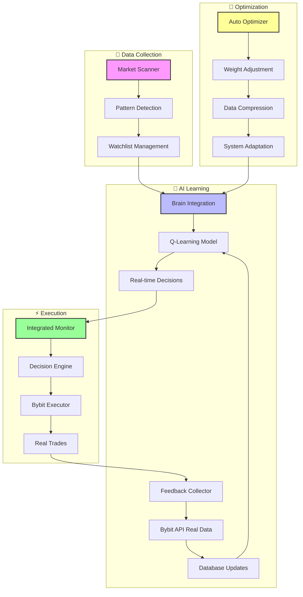

# 🤖 bot_sniper_AI - Multi-Exchange AI Trading Bot with End-to-End Learning

[](https://www.python.org/downloads/)
[](LICENSE)
[](https://github.com/bernini10/bot_sniper_AI/stargazers)
[](https://github.com/bernini10/bot_sniper_AI/network/members)
[](https://github.com/bernini10/bot_sniper_AI/issues)
[](https://github.com/bernini10/bot_sniper_AI#-end-to-end-learning-system)
[](https://github.com/bernini10/bot_sniper_AI#-algorithmic-trading)
[](https://www.bybit.com)
[](https://github.com/bernini10/bot_sniper_AI#-multi-exchange-support)

> **🚀 Sistema completo de trading algorítmico com aprendizado end-to-end que aprende com trades REAIS, não simulações.**

## 📋 Table of Contents
- [✨ Features](#-features)
- [🧠 End-to-End Learning System](#-end-to-end-learning-system)
- [🚀 Quick Start](#-quick-start)
- [📊 Dashboard](#-dashboard)
- [🏗️ Architecture](#️-architecture)
- [🤝 Community & Contributing](#-community--contributing)
- [💰 Sponsorship](#-sponsorship)
- [📈 Performance](#-performance)
- [📚 Documentation](#-documentation)
- [📄 License](#-license)

## ✨ Features

### 🤖 **AI-Powered Trading**
- **🧠 End-to-End Learning**: Real-time learning from actual trades (not simulations)
- **🔍 Pattern Recognition**: 11+ technical patterns across multiple timeframes
- **📊 Market Context**: BTC.D validation with 5 market scenarios
- **⚡ Real-time Execution**: Direct integration with Bybit API

### 🛡️ **Risk Management**
- **🎯 Protocolo Severino**: Rigorous methodology for safe trading
- **📉 Dynamic Stop-Loss**: Auto-adjusting based on market volatility
- **📈 Position Sizing**: Intelligent capital allocation
- **🔒 Post-Entry Validation**: Vision AI validation after entry

### 🔧 **Technical Excellence**
- **🐍 Python 3.8+**: Modern, maintainable codebase
- **📁 Modular Architecture**: Easy to extend and customize
- **📊 Real-time Dashboard**: Live monitoring and analytics
- **🔌 Multi-Exchange Ready**: Architecture supports multiple exchanges

## 🧠 End-to-End Learning System

### 🎯 **What Makes Us Different?**
Unlike most trading bots that use **simulated data**, bot_sniper_AI learns from **REAL trades**:

```
SCANNER → [Patterns] → MONITOR + BRAIN → [Decisions] → EXECUTOR → [Real Trades] → FEEDBACK REAL → BRAIN LEARNING
```

### 📊 **3-Phase Learning System**

#### **✅ Phase 1: Integration Restoration**
- `bot_monitor_v2_with_brain.py` - Integrated monitor with learning system
- Real-time brain integration with trading decisions
- Unified scanner → monitor → brain → executor pipeline

#### **✅ Phase 2: Real-Time Learning**
- `realtime_feedback_collector.py` - Collects REAL feedback from Bybit API
- Database automatically updated with `trade_result`, `reward`, `brain_decision`
- Brain learns from actual wins/losses (not simulations)

#### **✅ Phase 3: Auto-Optimization**
- `data_compactor.py` - Intelligent data compression preserving learning
- Auto-adjusting weights and counter-weights
- Continuous scanner feeding the model

### 🔬 **Technical Implementation**
- **Q-Learning with Experience Replay**
- **Neural Network**: 10 features → 64 → 64 → 3 actions (BUY/SELL/HOLD)
- **Training**: Incremental every 30 minutes
- **Memory**: 10,000 experiences (FIFO buffer)
- **Features**: Pattern confidence, market context, historical success

## 🚀 Quick Start

### 📦 **Prerequisites**
```bash
Python 3.8+
Bybit API Key (for real trading)
Google Gemini API Key (for Vision AI)
```

### 🔧 **Installation**
```bash
# Clone repository
git clone https://github.com/bernini10/bot_sniper_AI.git
cd bot_sniper_AI

# Install dependencies
pip install -r requirements.txt

# Configure environment
cp .env.example .env
# Edit .env with your API keys

# Initialize brain system
python3 setup_brain_system.py
```

### 🏃 **Running the System**
```bash
# Start complete end-to-end system
./launch_end_to_end_system.sh

# Or start components individually:
# 1. Brain Learning Daemon
python3 -c "from brain_integration import BrainIntegration; brain = BrainIntegration(); brain.initialize(); brain.continuous_learning(30)"

# 2. Feedback Collector
python3 realtime_feedback_collector.py

# 3. Integrated Monitor
python3 bot_monitor_v2_with_brain.py

# 4. Dashboard
python3 dashboard_server.py
```

## 📊 Dashboard

Access the real-time dashboard at: `http://localhost:8080`

### 📈 **Dashboard Features:**
- **Real-time Positions**: Live tracking of open trades
- **Performance Metrics**: Win rate, Sharpe ratio, P&L
- **Brain Learning Stats**: Training progress, memory usage
- **Market Context**: BTC.D dominance, market scenarios
- **Pattern Watchlist**: Active patterns with confidence scores

## 🏗️ Architecture



## 🤝 Community & Contributing

### 🌍 **We're Looking For:**
- **🔬 ML Researchers** for trading algorithms
- **💻 Python Developers** for core improvements
- **📊 Traders** for testing and real-world feedback
- **🎓 Academics** for case studies and research
- **🤝 Partners** to expand the project

### 🎯 **How to Contribute:**
1. **⭐ Star the repository** - Helps with visibility!
2. **🐛 Report issues** - Found a bug? Let us know!
3. **💡 Suggest features** - What would make bot_sniper_AI better?
4. **🔬 Submit PRs** - Code contributions welcome!
5. **📊 Share results** - How are you using the bot?

### 📝 **Contribution Guidelines:**
- Read our [CONTRIBUTING.md](CONTRIBUTING.md) (to be created)
- Follow [Protocolo Severino](PROTOCOLO-SEVERINO.md) methodology
- Test your changes thoroughly
- Document new features

## 💰 Sponsorship

### 🏆 **Support the Project**
bot_sniper_AI is developed with rigorous methodology and real-world testing. Your sponsorship helps:

- **🚀 Accelerate development** of new features
- **🔬 Fund research** in ML for trading
- **📚 Create educational content** for the community
- **🛠️ Maintain infrastructure** for testing

### 💎 **Sponsorship Tiers:**
```
🥉 Supporter: $5/month
  • Name in README sponsors section
  • Access to monthly updates

🥈 Contributor: $15/month
  • Early access to new features
  • Voting on roadmap priorities
  • Special Discord role

🥇 Sponsor: $50/month
  • Personalized consulting sessions
  • Priority support
  • Custom feature requests

💎 Enterprise: $200/month
  • Custom exchange integrations
  • Dedicated support channel
  • White-label solutions
```

### 🌐 **Sponsorship Platforms:**
- **GitHub Sponsors**: [Sponsor bernini10](https://github.com/sponsors/bernini10)
- **Open Collective**: (Coming soon)
- **Patreon**: (Coming soon)

## 📈 Performance

### 📊 **Current Statistics:**
- **Database Samples**: 6,669+ patterns in `raw_samples`
- **Pattern Images**: 6,000+ technical patterns detected
- **Real Trades**: Learning from actual Bybit executions
- **Win Rate**: Continuously monitored and optimized
- **Sharpe Ratio**: Auto-calculated and tracked

### 🎯 **Learning Progress:**
- **Training Cycles**: Continuous (30-minute intervals)
- **Experience Memory**: 10,000 capacity
- **Model Convergence**: Monitored via metrics
- **Error Reduction**: Tracked via TensorBoard logs

## 📚 Documentation

### 📖 **Complete Documentation:**
- [🧠 End-to-End Diagram](END_TO_END_DIAGRAM.md) - Complete system flow
- [📊 Investor Report](RELATORIO_INVESTIDORES_v2.4.0.md) - Detailed system analysis
- [🏗️ Brain Architecture](brain_architecture.md) - AI system design
- [🔧 Integration Guide](INTEGRATION_GUIDE.md) - How to integrate
- [📈 System Status](SYSTEM_STATUS.md) - Current status and metrics

### 🎓 **Educational Resources:**
- **Jupyter Notebooks**: (Coming soon)
- **Video Tutorials**: (Coming soon)
- **Academic Papers**: (Coming soon)
- **Case Studies**: (Coming soon)

## 📄 License

This project is licensed under the MIT License - see the [LICENSE](LICENSE) file for details.

### 🤝 **Open Source Philosophy:**
We believe in:
- **Transparency** in algorithmic trading
- **Education** through open source
- **Collaboration** with the community
- **Innovation** through shared knowledge

---

## 🚀 Get Started Today!

1. **⭐ Star the repository** to show your support
2. **🐛 Check open issues** to see where you can help
3. **💬 Join discussions** to share ideas
4. **🔧 Try the bot** with paper trading first
5. **🤝 Consider sponsoring** to support development

**📞 Questions? Issues? Suggestions?**
- GitHub Issues: [Report here](https://github.com/bernini10/bot_sniper_AI/issues)
- GitHub Discussions: [Join conversation](https://github.com/bernini10/bot_sniper_AI/discussions)
- Email: bernini10@gmail.com

---

**🎯 Developed with:** Rigor, precision, and deep investigation (Protocolo Severino)  
**🚀 Version:** v2.5.0 End-to-End Learning System  
**📅 Last Updated:** 2026-02-17  

*"True learning comes not from simulation, but from the reality of trades." - Protocolo Severino*
